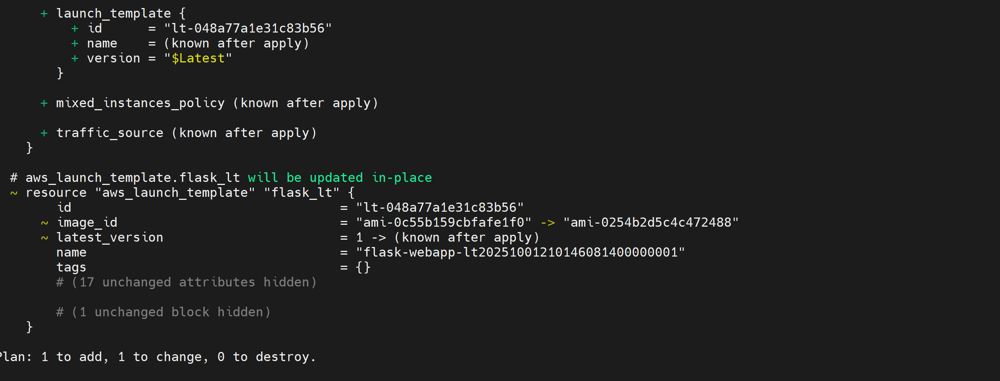
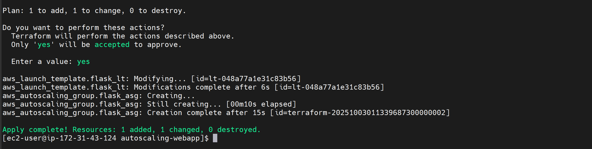
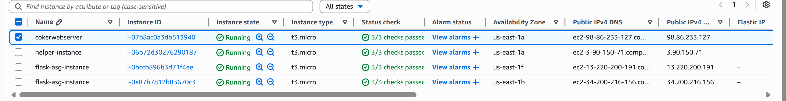
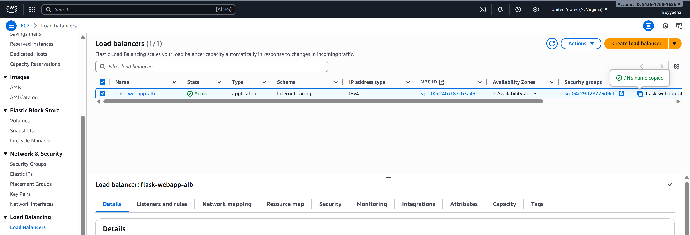
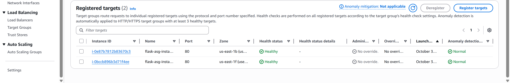
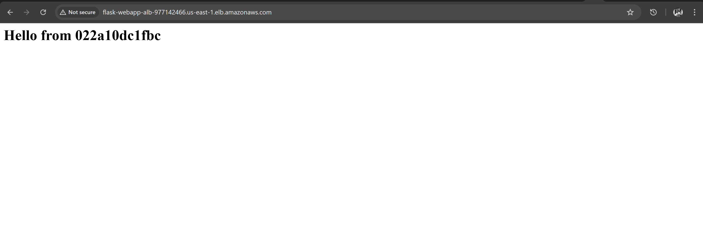

# Flask Web App on AWS with Auto Scaling & ALB

## Project Overview
This project demonstrates deploying a containerized **Flask web application** on AWS with:
- **Terraform** for Infrastructure as Code
- **Amazon ECR** for container images
- **EC2 Launch Template + Auto Scaling Group (ASG)** for scaling
- **Application Load Balancer (ALB)** for traffic distribution
- **IAM roles** for secure ECR pulls

The goal is to show **automated scaling, load balancing, and containerized deployment**.

---

## Architecture
1. Flask app is containerized and pushed to Amazon ECR.
2. Terraform provisions:
   - IAM roles for EC2 → ECR pulls
   - Launch Template with Docker + user_data
   - Auto Scaling Group (2–3 EC2 instances)
   - Application Load Balancer
3. ALB routes HTTP traffic to healthy EC2 instances running the Flask container.

---

## Terraform Deployment

### Plan

### Apply

---

## AWS Console Views

### EC2 Instances

### Load Balancer

### Target Group Health

---

## Web App Access
Access the running Flask app via the ALB DNS:(http://flask-webapp-alb-977142466.us-east-1.elb.amazonaws.com/)

