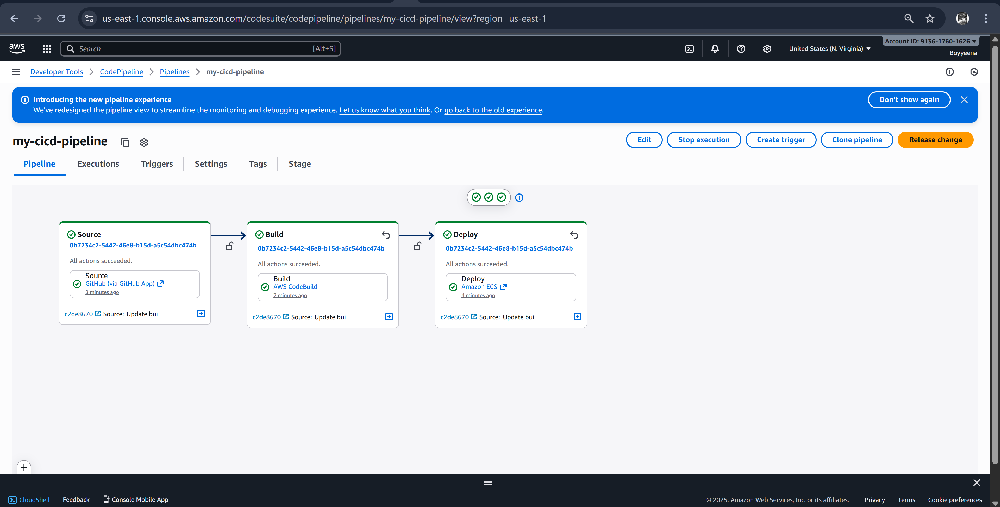
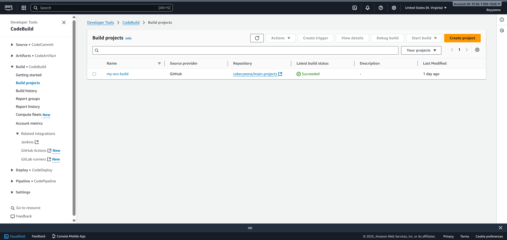
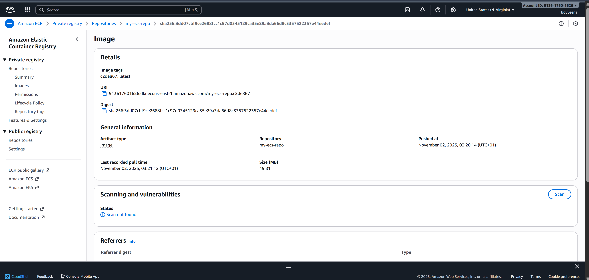
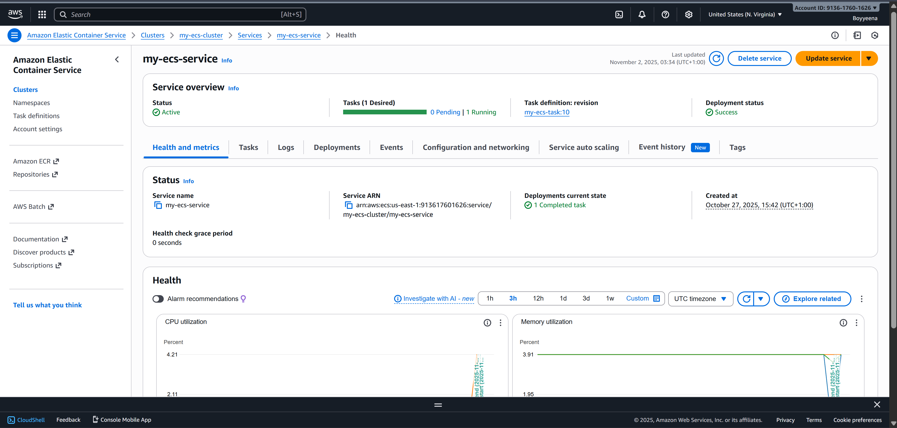

# AWS CI/CD Pipeline for Flask App Deployment on ECS

## Overview
This project demonstrates a complete **CI/CD pipeline** using **AWS CodePipeline**, **CodeBuild**, **ECR**, and **ECS** to automate the deployment of a simple Flask application.  
Whenever code is pushed to the GitHub repository, a new Docker image is built, pushed to Amazon ECR, and automatically deployed to ECS.

---

## Architecture
**Workflow:**
1. **Source Stage** – Pulls the latest code from GitHub.
2. **Build Stage** – Uses **AWS CodeBuild** to:
   - Build the Docker image from the `Dockerfile`.
   - Push the image to **Amazon ECR**.
   - Generate `imagedefinitions.json` for deployment.
3. **Deploy Stage** – **AWS CodePipeline** updates the running ECS service with the new image.

**Stack Components:**
- **AWS CodePipeline** – CI/CD Orchestration  
- **AWS CodeBuild** – Docker image builder  
- **Amazon ECR** – Image storage registry  
- **Amazon ECS (Fargate)** – Container deployment platform  
- **Docker** – Containerization engine  
- **Flask** – Minimal Python web framework  

---

## Deployment Flow

- **Push code → triggers CodePipeline.

- **CodeBuild runs the buildspec, builds Docker image, and pushes it to ECR.

- **CodePipeline Deploy Stage retrieves imagedefinitions.json and updates ECS service.

- **ECS automatically pulls the new image and restarts the task.

## Screenshots 

- **CodePipeline showing successful stages

- **CodeBuild logs (“Build succeeded”)

- **ECR repository with image tags

- **ECS service showing running tasks

CodePipeline

CodeBuild

ECR Repo

ECS service

## Result

- **Every time code is updated in the GitHub repo, the pipeline automatically:

- **Builds and pushes a new Docker image.

- **Deploys the latest version to ECS with zero manual steps.

- **This ensures continuous delivery and seamless updates to your Flask app.

## Future Improvements

- **Integrate CloudWatch for log monitoring.

## Project: AWS CI/CD Flask Deployment
- **Container Name: my-container
- **Repository: my-ecs-repo

## Gospel Coker
