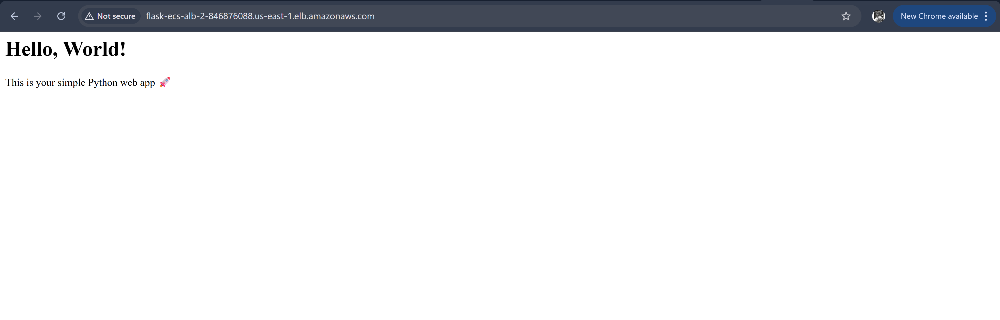
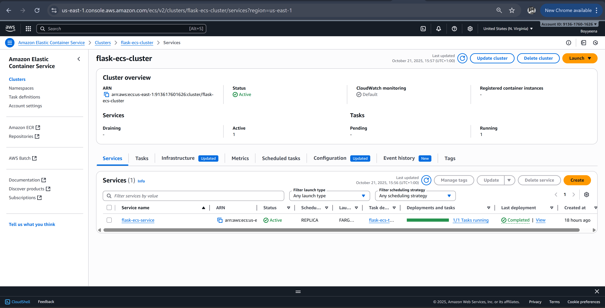
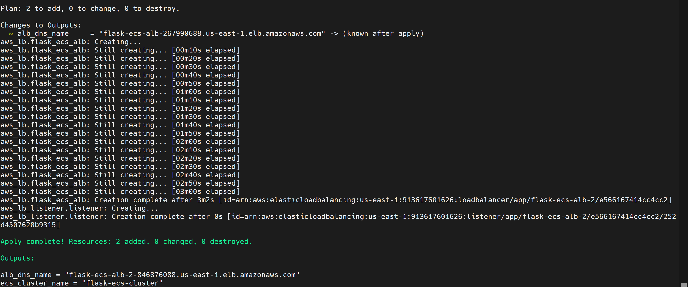

# AWS ECS Fargate Flask Deployment (Terraform + Docker)

A fully automated deployment of a **Flask web application** on **AWS ECS Fargate**, provisioned with **Terraform** and containerized with **Docker**.  
This project demonstrates real-world **DevOps automation** — from infrastructure as code to container orchestration and load balancing.

---

## Project Overview

This project provisions:
- An **Application Load Balancer (ALB)** for public traffic.
- An **ECS Fargate Cluster** running a Flask container.
- **IAM roles**, **security groups**, and **CloudWatch logs** automatically configured.
- **Terraform** for complete infrastructure automation.

Your app becomes accessible publicly through the ALB DNS name once deployed.

---

## Project Structure

├── app.py # Simple Flask app
├── dockerfile # Container build instructions
├── requirements.txt # Python dependencies
├── screenshots/ # Proof of deployment visuals
│ ├── ecs-cluster.png
│ ├── terraform-apply.png
│ └── alb-browser.png
├── terraform/ # All Terraform infrastructure code
│ ├── main.tf
│ ├── variables.tf
│ ├── terraform.tfvars
│ ├── output.tf
│ └── iam.tf
└── README.md


---

## Technologies Used

| **Cloud Provider** | AWS |
| **Containerization** | Docker |
| **Orchestration** | ECS Fargate |
| **Infrastructure as Code** | Terraform |
| **Programming Language** | Python (Flask) |
| **Monitoring / Logs** | CloudWatch |
| **Networking** | ALB, VPC, Security Groups |

---

## How It Works

1. **Terraform** provisions AWS infrastructure:
   - VPC, subnets, security groups, ECS cluster, ALB, IAM roles.
2. **ECS Fargate** runs the **Flask container** pulled from your image.
3. **ALB** routes HTTP requests to your running container.
4. Output provides your **public ALB URL** to access the app.

---


## Screenshots






## Setup Instructions

### Clone the Repository
```bash
git clone https://github.com/cokeryeena/main-projects.git
cd main-projects/compute/ecs-deployment/terraform

