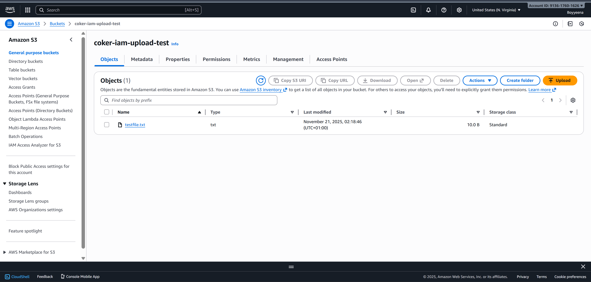
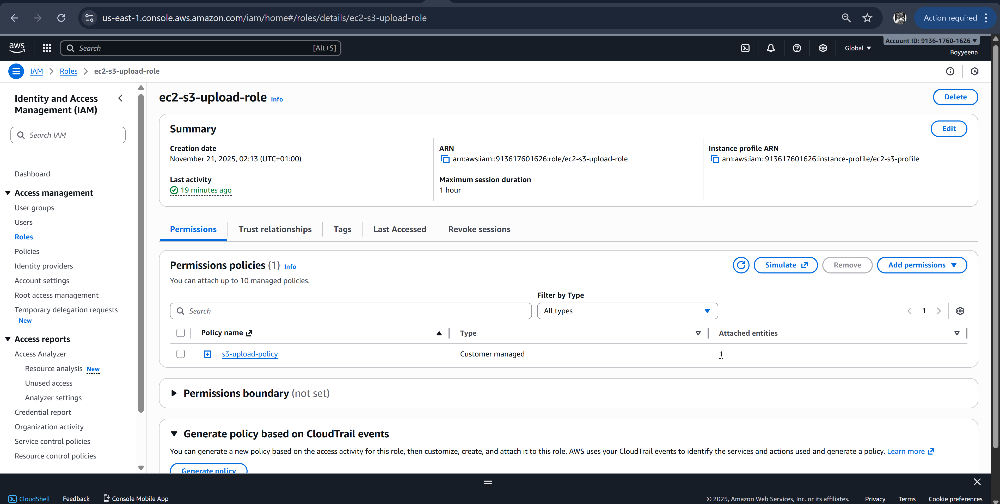
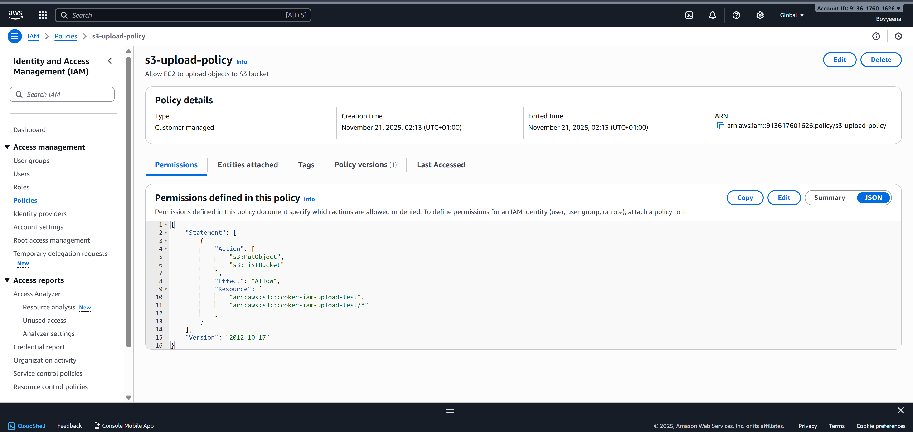
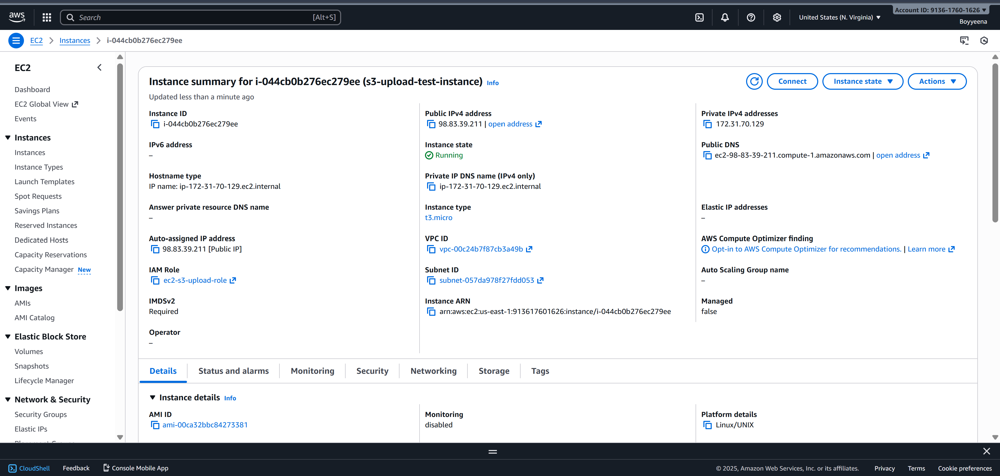
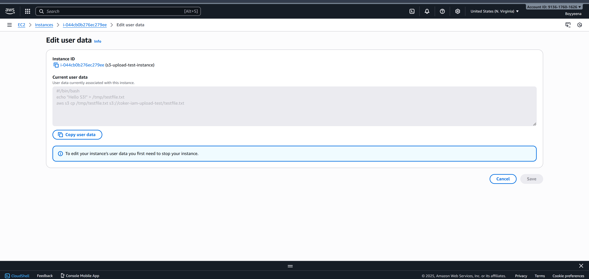

## S3 IAM Role-Based Upload (Terraform Project)

This project demonstrates how to securely upload files to Amazon S3 from an EC2 instance without using access keys. Instead, the EC2 instance uses an IAM role attached through an instance profile, following AWS best security practices.

The project automatically uploads a file (testfile.txt) to S3 the moment the EC2 instance boots — proving the role is working.

## Project Structure
storage/s3-iam-upload/
├─ main.tf
├─ variables.tf
├─ outputs.tf
└─ README.md

## This Project Demonstrates

- Creating an S3 bucket with Terraform
- Creating an IAM role EC2 can assume
- Attaching a custom S3 upload policy
- Creating an EC2 instance with an instance profile
- Using EC2 user data to automatically upload a file to S3
- Zero access keys — 100% role-based permissions

## Architecture Overview
EC2 Instance  ──  IAM Role (instance profile) ── S3 Bucket
                 (Upload permissions only)

The EC2 instance receives temporary, rotating credentials from the IAM role.
No static AWS keys. No secrets on the server. No risk.

## Technologies Used

** AWS S3

** AWS IAM

** AWS EC2

** Terraform

** Amazon Linux 2

** User Data scripts

## Screenshots
### 1. S3 Bucket

### 2. IAM Role for EC2

### 3. IAM Policy

### 4. Instance Profile

### 5. Terraform Apply

### 6. User Data

### 7. Upload Proof

## Deployment
Terraform (IaC)
