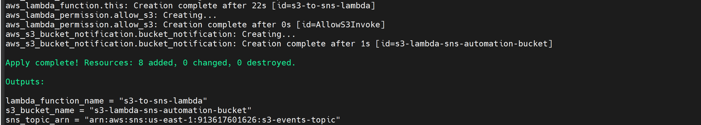
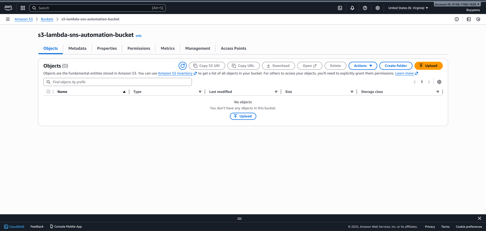
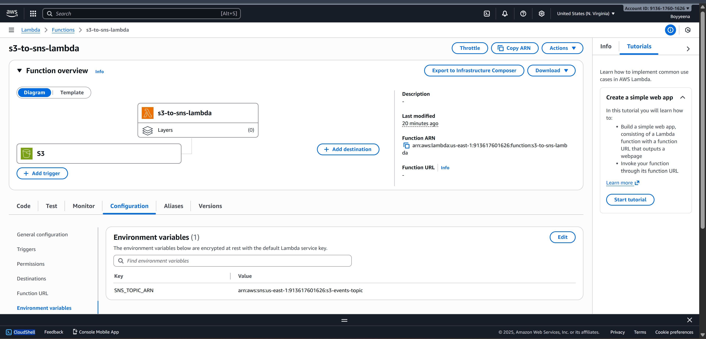
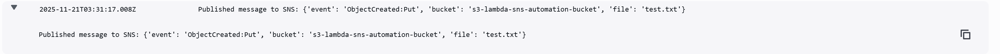
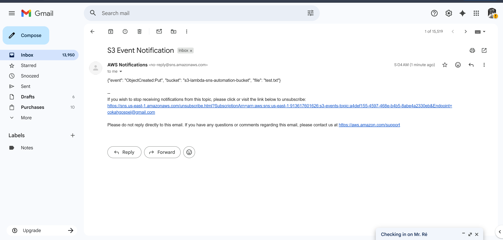

# S3 → Lambda → SNS Automation

## Overview
This project demonstrates a fully automated **serverless workflow** on AWS.  
When a file is uploaded to an S3 bucket, it triggers a Lambda function, which publishes a message to an SNS topic.  

The SNS topic is subscribed to my **email**, so I receive notifications for every new file uploaded.  

This setup highlights **event-driven architecture**, **serverless automation**, and practical **Terraform deployment**.

---

## Architecture

1. File uploaded to **S3 Bucket**  
2. S3 Event triggers **Lambda Function**  
3. Lambda publishes a JSON message to **SNS Topic**  
4. SNS sends a notification to my **email**

## Features

- Event-driven automation with **S3 → Lambda → SNS**
- Environment variable used for **SNS topic ARN**
- Minimal IAM permissions (least privilege)
- Fully deployable via Terraform
- Email notifications for immediate testing
- Easy to extend to Step Functions, SQS, or other workflows

## Screenshots

Terraform Apply

S3 Bucket

Lambda Function

SNS Topic

Test Event

SNS Email Notification

The email screenshot proves the workflow triggers end-to-end.
