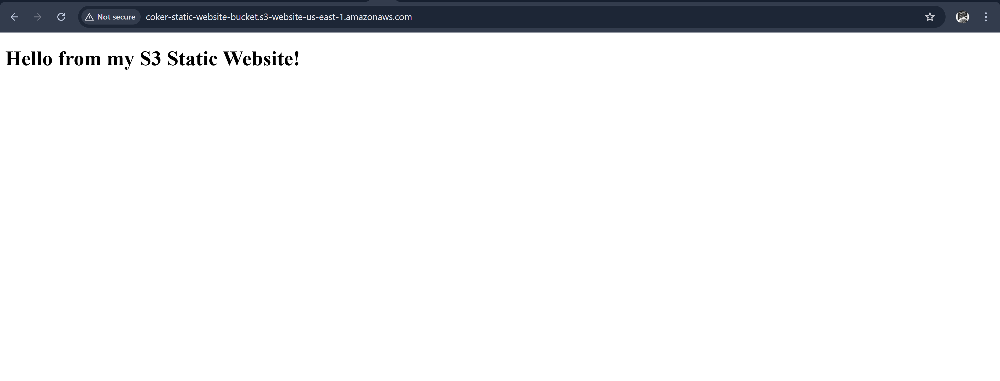

## Overview

This Terraform project deploys a static website using Amazon S3.
It automatically:

Creates an S3 bucket configured for static website hosting

Uploads HTML files (index.html and error.html)

Adds a public-read bucket policy

Outputs the website endpoint after deployment

Perfect for learning Terraform’s S3 automation and simple cloud hosting workflows.

## Infrastructure Components

Resource	                          Description

aws_s3_bucket	                        Stores website files
aws_s3_bucket_website_configuration	Enables website hosting mode
aws_s3_bucket_public_access_block	Disables public block restrictions
aws_s3_bucket_policy	                Grants public read access
aws_s3_object	                        Uploads static site files
output	                                Displays website URL endpoint

## Files Structure
s3-static-website/
├── main.tf          # Terraform resources
├── variables.tf     # Variables (optional)
├── outputs.tf       # Website endpoint output
├── index.html       # Home page
├── error.html       # Error page
└── README.md        # Documentation

## Prerequisites

Terraform >= 1.6

AWS CLI configured with an IAM user (with S3 full access)

An AWS account

## Screenshots
Terraform Apply 

Live Website

